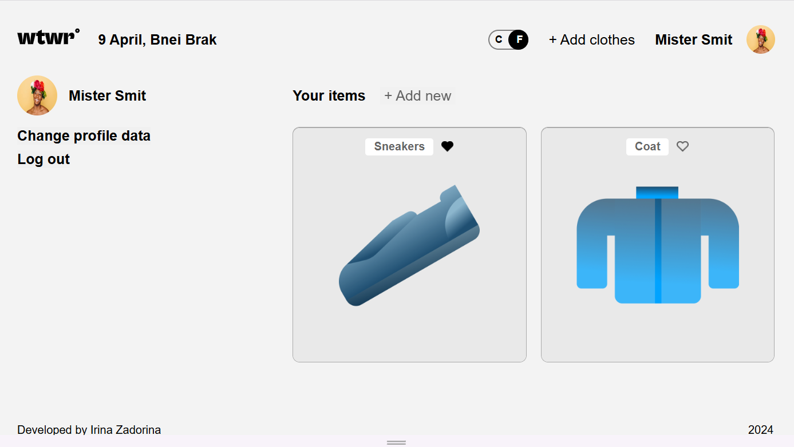

# React + Vite project : WTWR (What to Wear?)

## About the project

This code is the front-end of the WTWR app. The app shows a weather card depending on the temperature of the location of the user and shows compatible clothes to wear for the weather. It communicates with WeatherAPI and a customized database via a local server. Due to budget issues, the WTWR app is not hosted on Google CLoud anymore. You can clone this and the backend repos, install npm packages and run it locally ! Repo of the local server:
[https://github.com/i-zadorina/se_project_express]

## Technical Description

This app is using React and Vite, as also API calls, to display the weather and a proposition of clothes to wear according to the localisation's weather.

- [Figma Design](https://www.figma.com/file/DTojSwldenF9UPKQZd6RRb/Sprint-10%3A-WTWR)

- [Page](https://i-zadorina.github.io/se_project_react/)

- [Backend](https://github.com/i-zadorina/se_project_express)

## Plans to improve the project

Connect user's location API

## Screenshot of project:

